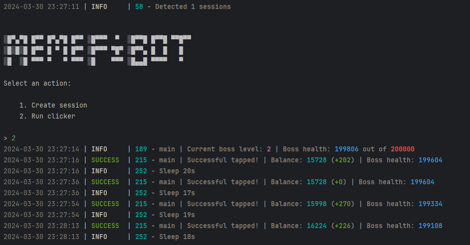

[](https://t.me/sho6ot)




> 🇪🇳 README in english available [here](README-EN.md)

## Функционал  
| Функционал                                                     | Поддерживается  |
|----------------------------------------------------------------|:---------------:|
| Многопоточность                                                |        ✅        |
| Привязка прокси к сессии                                       |        ✅        |
| Авто-покупка предметов при наличии монет (tap, energy, charge) |        ✅        |
| Рандомное время сна между кликами                              |        ✅        |
| Рандомное количество кликов за запрос                          |        ✅        |
| Поддержка tdata / pyrogram .session / telethon .session        |        ✅        |


## [Настройки](https://github.com/shamhi/MemeFiBot/blob/main/.env-example)
| Настройка                | Описание                                                                                                      |
|--------------------------|---------------------------------------------------------------------------------------------------------------|
| **API_ID / API_HASH**    | Данные платформы, с которой запускать сессию Telegram (сток - Android)                                        |
| **MIN_AVAILABLE_ENERGY** | Минимальное количество доступной энергии, при достижении которой будет задержка (напр. 100)                   |
| **SLEEP_BY_MIN_ENERGY**  | Задержка при достижении минимальной энергии в секундах (напр. [1800,3600])                                    |
| **ADD_TAPS_ON_TURBO**    | Сколько тапов будет добавлено при активации турбо (напр. 2500)                                                |
| **AUTO_UPGRADE_TAP**     | Улучшать ли тап (True / False)                                                                                |
| **MAX_TAP_LEVEL**        | Максимальный уровень прокачки тапа (напр. 5)                                                                  |
| **AUTO_UPGRADE_ENERGY**  | Улучшать ли энергию (True / False)                                                                            |
| **MAX_ENERGY_LEVEL**     | Максимальный уровень прокачки энергии (напр. 5)                                                               |
| **AUTO_UPGRADE_CHARGE**  | Улучшать ли заряд энергии (True / False)                                                                      |
| **MAX_CHARGE_LEVEL**     | Максимальный уровень прокачки заряда энергии (напр. 5)                                                        |
| **APPLY_DAILY_ENERGY**   | Использовать ли ежедневный бесплатный буст энергии (True / False)                                             |
| **APPLY_DAILY_TURBO**    | Использовать ли ежедневный бесплатный буст турбо (True / False)                                               |
| **RANDOM_CLICKS_COUNT**  | Рандомное количество тапов (напр. [50,200])                                                                   |
| **SLEEP_BETWEEN_TAP**    | Рандомная задержка между тапами в секундах (напр. [10,25])                                                    |
| **USE_PROXY_FROM_FILE**  | Использовать-ли прокси из файла `bot/config/proxies.txt` (True / False)                                       |
| **USE_TAP_BOT**          | Использовать ли тап-бота (True / False)                                                                       |
| **EMERGENCY_STOP**       | Использовать аварийный стоп (True / False), если True - при ошибке протокола стоп бота, чтобы не получить бан |

## Установка
Вы можете скачать [**Репозиторий**](https://github.com/shamhi/MemeFiBot) клонированием на вашу систему и установкой необходимых зависимостей:
```shell
~ >>> git clone https://github.com/shamhi/MemeFiBot.git 
~ >>> cd MemeFiBot

# Linux
~/MemeFiBot >>> python3 -m venv venv
~/MemeFiBot >>> source venv/bin/activate
~/MemeFiBot >>> pip3 install -r requirements.txt
~/MemeFiBot >>> cp .env-example .env
~/MemeFiBot >>> nano .env  # Здесь вы обязательно должны указать ваши API_ID и API_HASH , остальное берется по умолчанию
~/MemeFiBot >>> python3 main.py

# Windows
~/MemeFiBot >>> python -m venv venv
~/MemeFiBot >>> venv\Scripts\activate
~/MemeFiBot >>> pip install -r requirements.txt
~/MemeFiBot >>> copy .env-example .env
~/MemeFiBot >>> # Указываете ваши API_ID и API_HASH, остальное берется по умолчанию
~/MemeFiBot >>> python main.py
```

Также для быстрого запуска вы можете использовать аргументы, например:
```shell
~/MemeFiBot >>> python3 main.py --action (1/2)
# Или
~/MemeFiBot >>> python3 main.py -a (1/2)

# 1 - Создает сессию
# 2 - Запускает кликер
```
